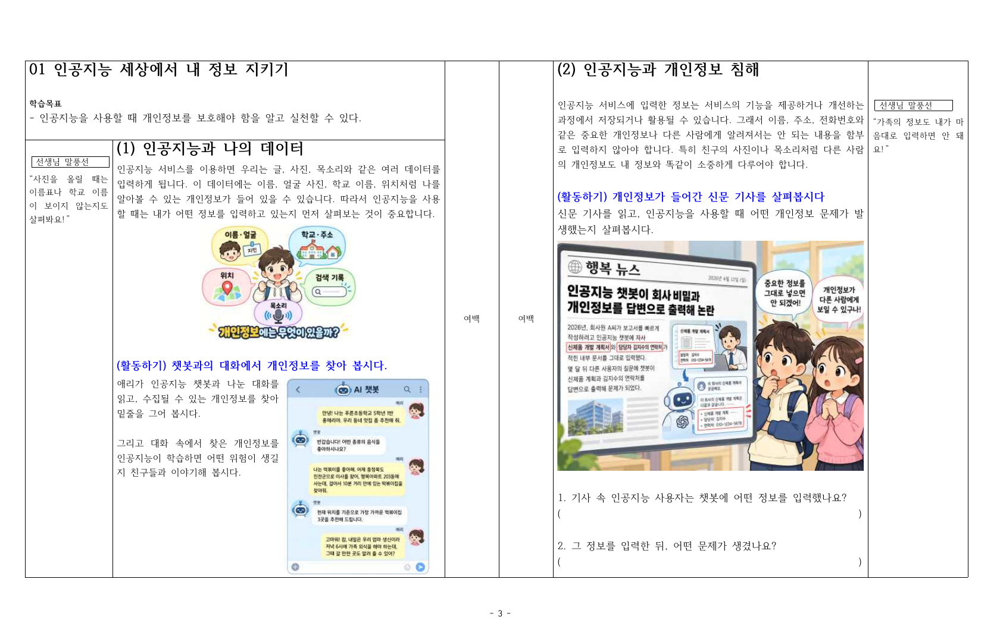
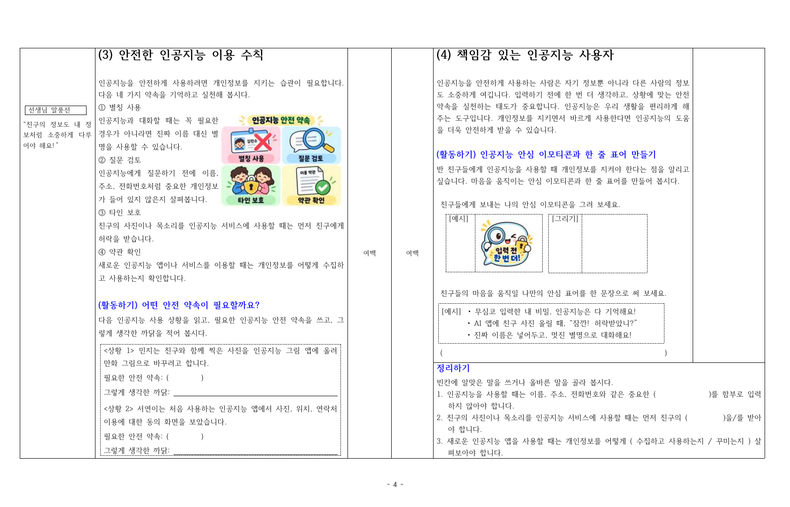
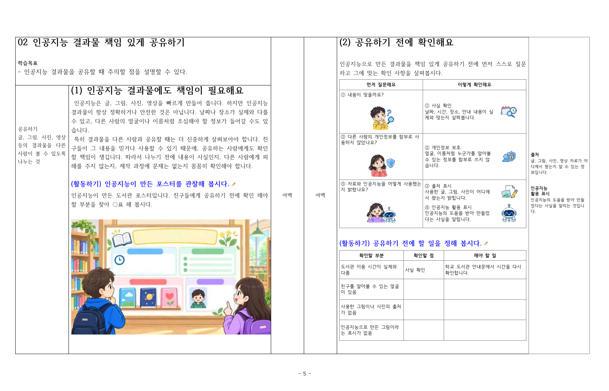
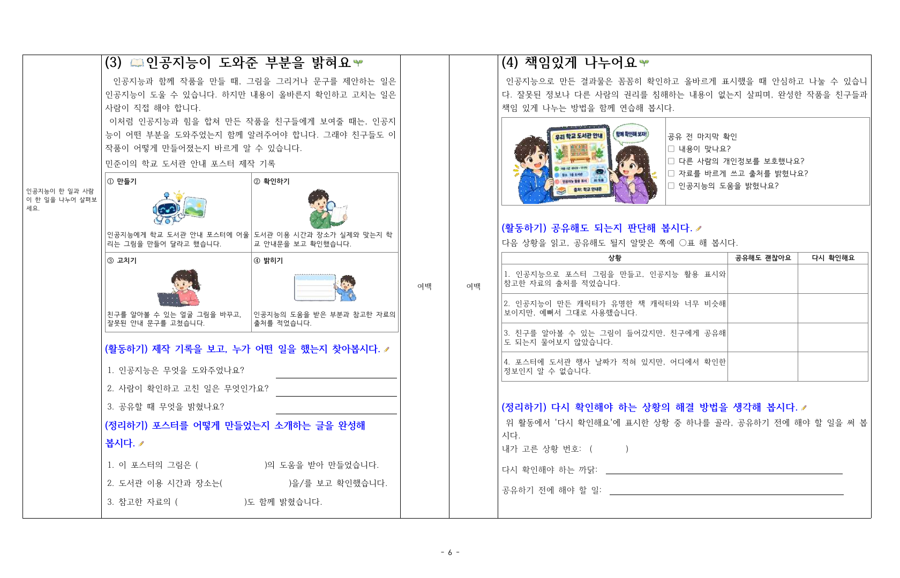
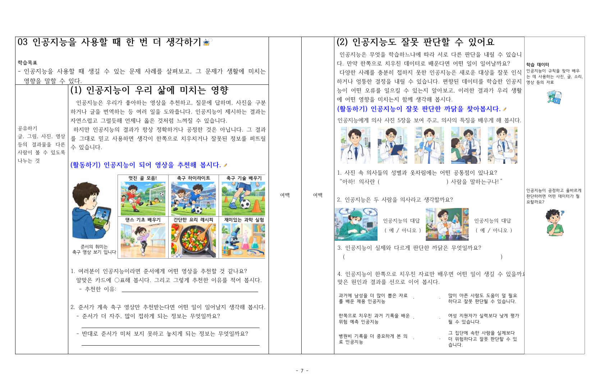
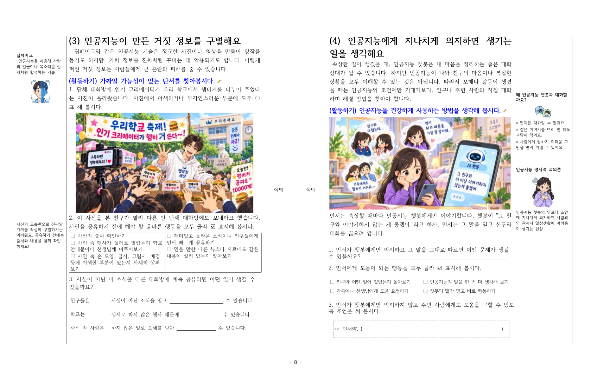
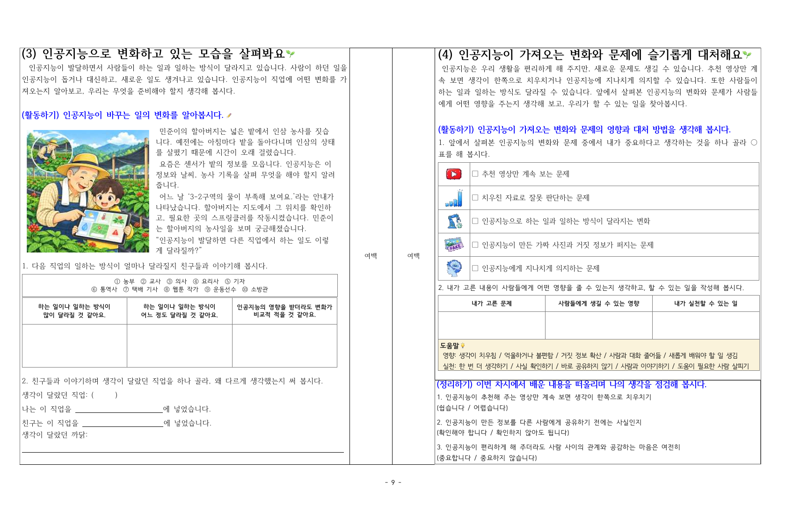
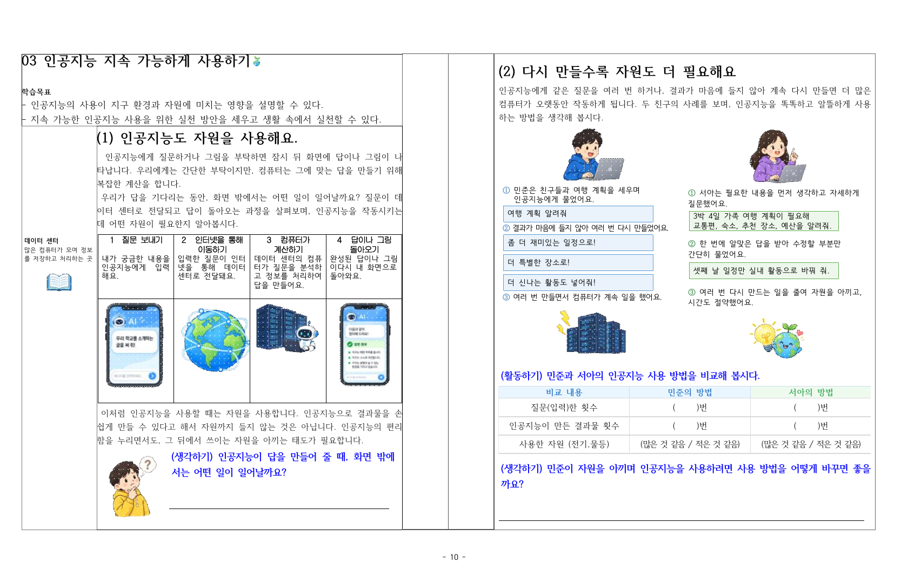
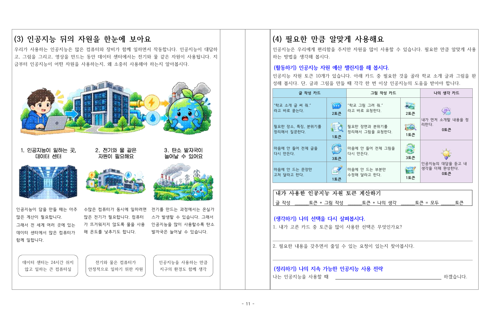
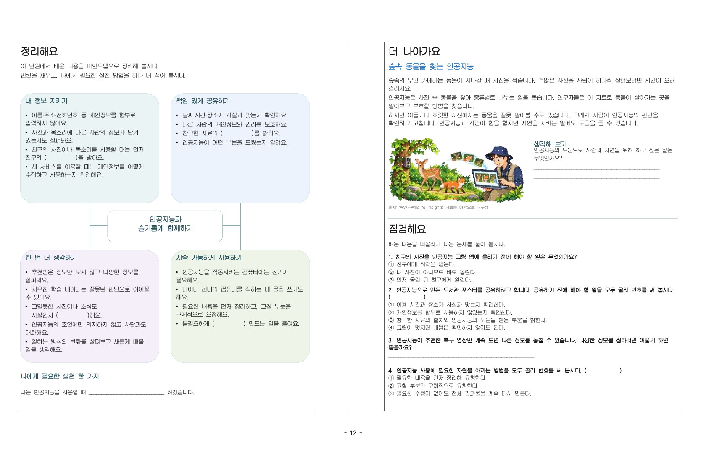

# 편집자용 이미지 배치 목록

기준 원고: [초등5_인공지능리터러시_4단원_12쪽수정완료.hwpx](./01_원고/초등5_인공지능리터러시_4단원_12쪽수정완료.hwpx)

쪽수는 이 한글 파일 및 [지면 확인 PDF](./01_원고/초등5_인공지능리터러시_4단원_12쪽수정완료.pdf)의 아래쪽에 인쇄된 **펼침 지면 번호 1~12**이다. 각 펼침의 왼쪽 페이지와 오른쪽 페이지를 구분했다. 과거 `pic` 파일명에 적힌 쪽수를 사용하지 않는다.

이미지 파일 **77종**, 실제 삽입 위치 **89곳**을 모두 기록했다. 재사용 그림은 한 파일만 전달하고 사용 위치마다 별도 행을 작성했다. `P001`~`P089`는 이 목록의 배치 번호이며 한글 파일에 새로 넣은 번호가 아니다.

[전달 안내](./전달안내.md) · [77종 파일 목록](./이미지_파일목록.md) · [이미지 미리보기](./이미지_미리보기.md) · [자르기 설정](./이미지_자르기설정.md)

## 쪽별 확인표

| 펼침 쪽수 | 왼쪽 페이지 삽입 수 | 오른쪽 페이지 삽입 수 | 합계 | 지면 미리보기 |
|---:|---:|---:|---:|---|
| 1 | 0 | 0 | 0 | [01쪽](./03_지면미리보기/01쪽.png) |
| 2 | 0 | 0 | 0 | [02쪽](./03_지면미리보기/02쪽.png) |
| 3 | 2 | 1 | 3 | [03쪽](./03_지면미리보기/03쪽.png) |
| 4 | 1 | 1 | 2 | [04쪽](./03_지면미리보기/04쪽.png) |
| 5 | 2 | 8 | 10 | [05쪽](./03_지면미리보기/05쪽.png) |
| 6 | 8 | 4 | 12 | [06쪽](./03_지면미리보기/06쪽.png) |
| 7 | 9 | 10 | 19 | [07쪽](./03_지면미리보기/07쪽.png) |
| 8 | 3 | 4 | 7 | [08쪽](./03_지면미리보기/08쪽.png) |
| 9 | 3 | 7 | 10 | [09쪽](./03_지면미리보기/09쪽.png) |
| 10 | 7 | 4 | 11 | [10쪽](./03_지면미리보기/10쪽.png) |
| 11 | 4 | 10 | 14 | [11쪽](./03_지면미리보기/11쪽.png) |
| 12 | 0 | 1 | 1 | [12쪽](./03_지면미리보기/12쪽.png) |

‘원고 표시 크기’는 실제 한컴 PDF에서 확인한 그림의 외접 사각형 폭×높이이며 단위는 mm이다. 투명 여백을 포함하므로 그림 안의 인물·사물 자체의 크기와는 다를 수 있다. 새 조판에서는 지면에 맞게 조정하되 비율·잘라내기는 원고와 미리보기를 함께 확인한다.

## 01쪽

이 지면에는 독립 이미지 개체가 없다. 제목·본문·표·한글 도형은 이미지 파일 목록에서 제외했다.

## 02쪽

이 지면에는 독립 이미지 개체가 없다. 제목·본문·표·한글 도형은 이미지 파일 목록에서 제외했다.

## 03쪽

| 배치 번호 | 페이지 위치 | 세부 위치 | 사용할 이미지 파일 | 원고 표시 크기(mm) | 자르기 |
|---|---|---|---|---|---|
| P001 | 왼쪽 페이지 | 본문 중단 ‘개인정보에는 무엇이 있을까?’ 그림 | [03쪽_왼_개인정보종류_image1.png](./02_이미지/03쪽_왼_개인정보종류_image1.png) | 65.7×49.3 | 전체 |
| P002 | 왼쪽 페이지 | 하단 ‘챗봇과의 대화에서 개인정보를 찾아 봅시다’ 활동의 오른쪽 대화 화면 | [03쪽_왼_챗봇대화예시_image2.png](./02_이미지/03쪽_왼_챗봇대화예시_image2.png) | 66.6×83.2 | 전체 |
| P003 | 오른쪽 페이지 | 중단 ‘개인정보가 들어간 신문 기사’ 활동의 기사 그림 | [03쪽_오른_개인정보유출신문기사_image3.png](./02_이미지/03쪽_오른_개인정보유출신문기사_image3.png) | 128.7×96.6 | 전체 |

## 04쪽

| 배치 번호 | 페이지 위치 | 세부 위치 | 사용할 이미지 파일 | 원고 표시 크기(mm) | 자르기 |
|---|---|---|---|---|---|
| P004 | 왼쪽 페이지 | 상단 안전한 이용 수칙 설명 오른쪽 | [04쪽_왼_인공지능안전약속_image4.png](./02_이미지/04쪽_왼_인공지능안전약속_image4.png) | 66.7×50.1 | 전체 |
| P005 | 오른쪽 페이지 | 중단 ‘안심 이모티콘과 한 줄 표어 만들기’의 이모티콘 예시 | [04쪽_오른_입력전한번더이모티콘_image5.png](./02_이미지/04쪽_오른_입력전한번더이모티콘_image5.png) | 29.7×29.7 | 전체 |

## 05쪽

| 배치 번호 | 페이지 위치 | 세부 위치 | 사용할 이미지 파일 | 원고 표시 크기(mm) | 자르기 |
|---|---|---|---|---|---|
| P006 | 왼쪽 페이지 | 중단 ‘인공지능이 만든 포스터를 관찰해 봅시다’ 제목 끝 | [공통_양쪽_활동연필아이콘_image13.png](./02_이미지/공통_양쪽_활동연필아이콘_image13.png) | 5.3×3.5 | 전체 |
| P007 | 왼쪽 페이지 | 하단 도서관 포스터 관찰 활동의 메인 그림 | [05쪽_왼_도서관포스터확인장면_image14.png](./02_이미지/05쪽_왼_도서관포스터확인장면_image14.png) | 141.0×79.3 | 전체 |
| P008 | 오른쪽 페이지 | 상단 확인 표 ① 사실 확인 항목 오른쪽 | [05쪽_오른_사실확인아이콘_image7.png](./02_이미지/05쪽_오른_사실확인아이콘_image7.png) | 18.7×12.4 | 전체 |
| P009 | 오른쪽 페이지 | 상단 확인 표 ① ‘내용이 맞을까요?’ 질문 칸 | [05쪽_오른_내용확인학생_image6.png](./02_이미지/05쪽_오른_내용확인학생_image6.png) | 26.8×17.9 | 전체 |
| P010 | 오른쪽 페이지 | 중단 확인 표 ② 개인정보 보호 항목 오른쪽 | [05쪽_오른_개인정보보호아이콘_image9.png](./02_이미지/05쪽_오른_개인정보보호아이콘_image9.png) | 18.7×12.4 | 전체 |
| P011 | 오른쪽 페이지 | 중단 확인 표 ② 개인정보 사용 여부를 묻는 질문 칸 | [05쪽_오른_피해확인학생_image8.png](./02_이미지/05쪽_오른_피해확인학생_image8.png) | 26.8×17.9 | 전체 |
| P012 | 오른쪽 페이지 | 중단 확인 표 ③ 출처 표시 항목 오른쪽 위 | [05쪽_오른_출처표시아이콘_image11.png](./02_이미지/05쪽_오른_출처표시아이콘_image11.png) | 18.7×12.4 | 전체 |
| P013 | 오른쪽 페이지 | 중단 확인 표 ③ 자료·인공지능 활용을 묻는 질문 칸 | [05쪽_오른_인공지능활용학생_image10.png](./02_이미지/05쪽_오른_인공지능활용학생_image10.png) | 27.0×18.0 | 전체 |
| P014 | 오른쪽 페이지 | 중단 확인 표 ③ 인공지능 활용 표시 항목 오른쪽 아래 | [05쪽_오른_인공지능활용표시아이콘_image12.png](./02_이미지/05쪽_오른_인공지능활용표시아이콘_image12.png) | 15.5×15.5 | 전체 |
| P015 | 오른쪽 페이지 | 하단 ‘공유하기 전에 할 일을 정해 봅시다’ 제목 끝 | [공통_양쪽_활동연필아이콘_image13.png](./02_이미지/공통_양쪽_활동연필아이콘_image13.png) | 5.3×3.5 | 전체 |

## 06쪽

| 배치 번호 | 페이지 위치 | 세부 위치 | 사용할 이미지 파일 | 원고 표시 크기(mm) | 자르기 |
|---|---|---|---|---|---|
| P016 | 왼쪽 페이지 | 맨 위 ‘인공지능이 도와준 부분을 밝혀요’ 제목 앞 책 아이콘 | [06쪽_왼_펼친책아이콘_image15.png](./02_이미지/06쪽_왼_펼친책아이콘_image15.png) | 8.2×5.5 | 전체 |
| P017 | 왼쪽 페이지 | 맨 위 ‘인공지능이 도와준 부분을 밝혀요’ 제목 끝 새싹 | [06쪽_양쪽_새싹아이콘_image16.png](./02_이미지/06쪽_양쪽_새싹아이콘_image16.png) | 6.6×5.5 | 전체 |
| P018 | 왼쪽 페이지 | 중단 제작 기록 표 ① 만들기 그림 | [06쪽_왼_제작기록_만들기_image18.png](./02_이미지/06쪽_왼_제작기록_만들기_image18.png) | 30.2×20.1 | 전체 |
| P019 | 왼쪽 페이지 | 중단 제작 기록 표 ② 확인하기 그림 | [06쪽_왼_제작기록_확인하기_image19.png](./02_이미지/06쪽_왼_제작기록_확인하기_image19.png) | 24.1×20.1 | 전체 |
| P020 | 왼쪽 페이지 | 중단 제작 기록 표 ③ 고치기 그림 | [06쪽_왼_제작기록_고치기_image20.png](./02_이미지/06쪽_왼_제작기록_고치기_image20.png) | 22.7×20.1 | 전체 |
| P021 | 왼쪽 페이지 | 중단 제작 기록 표 ④ 밝히기 그림 | [06쪽_왼_제작기록_밝히기_image21.png](./02_이미지/06쪽_왼_제작기록_밝히기_image21.png) | 30.2×20.1 | 전체 |
| P022 | 왼쪽 페이지 | 하단 ‘제작 기록을 보고, 누가 어떤 일을 했는지 찾아봅시다’ 제목 끝 | [공통_양쪽_활동연필아이콘_image13.png](./02_이미지/공통_양쪽_활동연필아이콘_image13.png) | 5.3×3.5 | 전체 |
| P023 | 왼쪽 페이지 | 하단 ‘포스터를 어떻게 만들었는지 소개하는 글을 완성해 봅시다’ 제목 끝 | [공통_양쪽_활동연필아이콘_image13.png](./02_이미지/공통_양쪽_활동연필아이콘_image13.png) | 5.3×3.5 | 전체 |
| P024 | 오른쪽 페이지 | 맨 위 ‘책임 있게 나누어요’ 제목 끝 새싹 | [06쪽_양쪽_새싹아이콘_image16.png](./02_이미지/06쪽_양쪽_새싹아이콘_image16.png) | 6.6×5.5 | 전체 |
| P025 | 오른쪽 페이지 | 상단 ‘공유 전 마지막 확인’ 표의 왼쪽 그림 | [06쪽_오른_태블릿공유장면_글자포함_image17.png](./02_이미지/06쪽_오른_태블릿공유장면_글자포함_image17.png) | 70.5×39.7 | 전체 |
| P026 | 오른쪽 페이지 | 중단 ‘공유해도 되는지 판단해 봅시다’ 제목 끝 | [공통_양쪽_활동연필아이콘_image13.png](./02_이미지/공통_양쪽_활동연필아이콘_image13.png) | 5.3×3.5 | 전체 |
| P027 | 오른쪽 페이지 | 하단 ‘다시 확인해야 하는 상황의 해결 방법을 생각해 봅시다’ 제목 끝 | [공통_양쪽_활동연필아이콘_image13.png](./02_이미지/공통_양쪽_활동연필아이콘_image13.png) | 5.3×3.5 | 전체 |

## 07쪽

| 배치 번호 | 페이지 위치 | 세부 위치 | 사용할 이미지 파일 | 원고 표시 크기(mm) | 자르기 |
|---|---|---|---|---|---|
| P028 | 왼쪽 페이지 | 맨 위 ‘인공지능을 사용할 때 한 번 더 생각하기’ 제목 끝 로봇 | [07쪽_왼_제목로봇마스코트_image22.png](./02_이미지/07쪽_왼_제목로봇마스코트_image22.png) | 8.2×5.5 | 전체 |
| P029 | 왼쪽 페이지 | 중단 ‘인공지능이 되어 영상을 추천해 봅시다’ 제목 끝 | [공통_양쪽_활동연필아이콘_image13.png](./02_이미지/공통_양쪽_활동연필아이콘_image13.png) | 5.3×3.5 | 전체 |
| P030 | 왼쪽 페이지 | 중단 추천 영상 카드 여섯 장의 왼쪽 학생 | [07쪽_왼_축구영상을보는학생_image25.bmp](./02_이미지/07쪽_왼_축구영상을보는학생_image25.bmp) | 27.3×42.7 | 전체 |
| P031 | 왼쪽 페이지 | 중단 추천 영상 카드 윗줄 왼쪽 ‘멋진 골 모음!’ | [07쪽_왼_추천영상_멋진골모음_image26.png](./02_이미지/07쪽_왼_추천영상_멋진골모음_image26.png) | 31.0×23.3 | 전체 |
| P032 | 왼쪽 페이지 | 중단 추천 영상 카드 윗줄 가운데 ‘축구 하이라이트’ | [07쪽_왼_추천영상_축구하이라이트_image27.png](./02_이미지/07쪽_왼_추천영상_축구하이라이트_image27.png) | 31.0×23.3 | 전체 |
| P033 | 왼쪽 페이지 | 중단 추천 영상 카드 윗줄 오른쪽 ‘축구 기술 배우기’ | [07쪽_왼_추천영상_축구기술배우기_image28.png](./02_이미지/07쪽_왼_추천영상_축구기술배우기_image28.png) | 31.0×23.3 | 전체 |
| P034 | 왼쪽 페이지 | 중단 추천 영상 카드 아랫줄 왼쪽 ‘댄스 기초 배우기’ | [07쪽_왼_추천영상_댄스기초배우기_image29.png](./02_이미지/07쪽_왼_추천영상_댄스기초배우기_image29.png) | 31.0×23.3 | 전체 |
| P035 | 왼쪽 페이지 | 중단 추천 영상 카드 아랫줄 가운데 ‘간단한 요리 레시피’ | [07쪽_왼_추천영상_간단한요리레시피_image30.png](./02_이미지/07쪽_왼_추천영상_간단한요리레시피_image30.png) | 31.0×23.3 | 전체 |
| P036 | 왼쪽 페이지 | 중단 추천 영상 카드 아랫줄 오른쪽 ‘재미있는 과학 실험’ | [07쪽_왼_추천영상_재미있는과학실험_image31.png](./02_이미지/07쪽_왼_추천영상_재미있는과학실험_image31.png) | 31.0×23.3 | 전체 |
| P037 | 오른쪽 페이지 | 바깥쪽 여백 상단 ‘학습 데이터’ 설명 아래 아이콘 | [07쪽_오른_학습데이터아이콘_image23.png](./02_이미지/07쪽_오른_학습데이터아이콘_image23.png) | 13.8×13.8 | 전체 |
| P038 | 오른쪽 페이지 | 상단 ‘인공지능이 잘못 판단한 까닭을 찾아봅시다’ 제목 끝 | [공통_양쪽_활동연필아이콘_image13.png](./02_이미지/공통_양쪽_활동연필아이콘_image13.png) | 5.3×3.5 | 전체 |
| P039 | 오른쪽 페이지 | 중단 학습 사진 다섯 장 중 왼쪽에서 첫 번째 | [07쪽_오른_학습사진1_청진기의사_image32.png](./02_이미지/07쪽_오른_학습사진1_청진기의사_image32.png) | 20.4×25.6 | 전체 |
| P040 | 오른쪽 페이지 | 중단 학습 사진 다섯 장 중 왼쪽에서 두 번째 | [07쪽_오른_학습사진2_차트보는의사_image33.png](./02_이미지/07쪽_오른_학습사진2_차트보는의사_image33.png) | 20.4×25.6 | 전체 |
| P041 | 오른쪽 페이지 | 중단 학습 사진 다섯 장 중 왼쪽에서 세 번째 | [07쪽_오른_학습사진3_주사기의사_image34.png](./02_이미지/07쪽_오른_학습사진3_주사기의사_image34.png) | 20.4×25.6 | 전체 |
| P042 | 오른쪽 페이지 | 중단 학습 사진 다섯 장 중 왼쪽에서 네 번째 | [07쪽_오른_학습사진4_환자와의사_image35.png](./02_이미지/07쪽_오른_학습사진4_환자와의사_image35.png) | 20.4×25.6 | 전체 |
| P043 | 오른쪽 페이지 | 중단 학습 사진 다섯 장 중 왼쪽에서 다섯 번째 | [07쪽_오른_학습사진5_팔짱낀의사_image36.png](./02_이미지/07쪽_오른_학습사진5_팔짱낀의사_image36.png) | 20.4×25.6 | 전체 |
| P044 | 오른쪽 페이지 | 바깥쪽 여백 중단 ‘어떤 데이터가 필요할까요?’ 질문 아래 학생 | [07쪽_오른_캐릭터질문학생_image24.png](./02_이미지/07쪽_오른_캐릭터질문학생_image24.png) | 17.6×21.0 | 전체 |
| P045 | 오른쪽 페이지 | 중하단 판단 대상 사진 왼쪽, 여성 의사 | [07쪽_오른_판단대상_여자의사_image37.png](./02_이미지/07쪽_오른_판단대상_여자의사_image37.png) | 30.0×22.5 | 전체 |
| P046 | 오른쪽 페이지 | 중하단 판단 대상 사진 오른쪽, 과학 선생님 | [07쪽_오른_판단대상_과학선생님_image38.png](./02_이미지/07쪽_오른_판단대상_과학선생님_image38.png) | 30.0×22.5 | 전체 |

## 08쪽

| 배치 번호 | 페이지 위치 | 세부 위치 | 사용할 이미지 파일 | 원고 표시 크기(mm) | 자르기 |
|---|---|---|---|---|---|
| P047 | 왼쪽 페이지 | 바깥쪽 여백 상단 ‘딥페이크’ 설명 아래 얼굴 아이콘 | [08쪽_왼_딥페이크얼굴아이콘_image39.png](./02_이미지/08쪽_왼_딥페이크얼굴아이콘_image39.png) | 17.3×19.8 | 전체 |
| P048 | 왼쪽 페이지 | 상단 ‘가짜일 가능성이 있는 단서를 찾아봅시다’ 제목 끝 | [공통_양쪽_활동연필아이콘_image13.png](./02_이미지/공통_양쪽_활동연필아이콘_image13.png) | 5.3×3.5 | 전체 |
| P049 | 왼쪽 페이지 | 중단 학교 축제 사진 관찰 활동의 메인 그림 | [08쪽_왼_학교축제허위사진_image42.png](./02_이미지/08쪽_왼_학교축제허위사진_image42.png) | 126.1×71.0 | 전체 |
| P050 | 오른쪽 페이지 | 바깥쪽 여백 상단 ‘왜 인공지능 챗봇과 대화할까?’ 설명 위 아이콘 | [08쪽_오른_AI대화아이콘_image40.png](./02_이미지/08쪽_오른_AI대화아이콘_image40.png) | 16.9×11.3 | 전체 |
| P051 | 오른쪽 페이지 | 상단 ‘인공지능을 건강하게 사용하는 방법을 생각해 봅시다’ 제목 끝 | [공통_양쪽_활동연필아이콘_image13.png](./02_이미지/공통_양쪽_활동연필아이콘_image13.png) | 5.3×3.5 | 전체 |
| P052 | 오른쪽 페이지 | 중단 민서와 인공지능 챗봇의 상황 그림 | [08쪽_오른_챗봇조언에의존하는학생_image43.png](./02_이미지/08쪽_오른_챗봇조언에의존하는학생_image43.png) | 128.8×65.3 | [자르기 있음](./이미지_자르기설정.md) |
| P053 | 오른쪽 페이지 | 바깥쪽 여백 중단 ‘인공지능 정서적 과의존’ 설명의 학생 | [08쪽_오른_정서적의존학생_image41.png](./02_이미지/08쪽_오른_정서적의존학생_image41.png) | 16.9×25.4 | 전체 |

## 09쪽

| 배치 번호 | 페이지 위치 | 세부 위치 | 사용할 이미지 파일 | 원고 표시 크기(mm) | 자르기 |
|---|---|---|---|---|---|
| P054 | 왼쪽 페이지 | 맨 위 ‘인공지능으로 변화하고 있는 모습을 살펴봐요’ 제목 끝 | [09쪽_양쪽_새싹아이콘_image44.png](./02_이미지/09쪽_양쪽_새싹아이콘_image44.png) | 5.5×5.5 | 전체 |
| P055 | 왼쪽 페이지 | 상단 ‘인공지능이 바꾸는 일의 변화를 알아봅시다’ 제목 끝 | [공통_양쪽_활동연필아이콘_image13.png](./02_이미지/공통_양쪽_활동연필아이콘_image13.png) | 5.3×3.5 | 전체 |
| P056 | 왼쪽 페이지 | 상단 인삼밭 관리 사례의 왼쪽 그림 | [09쪽_왼_인삼밭AI관리장면_image45.png](./02_이미지/09쪽_왼_인삼밭AI관리장면_image45.png) | 65.3×65.3 | 전체 |
| P057 | 오른쪽 페이지 | 맨 위 ‘인공지능이 가져오는 변화와 문제에 슬기롭게 대처해요’ 제목 끝 | [09쪽_양쪽_새싹아이콘_image44.png](./02_이미지/09쪽_양쪽_새싹아이콘_image44.png) | 5.5×5.5 | 전체 |
| P058 | 오른쪽 페이지 | 중단 변화·문제 선택 표 첫 번째 행, 추천 영상 아이콘 | [09쪽_오른_추천영상아이콘_image46.png](./02_이미지/09쪽_오른_추천영상아이콘_image46.png) | 11.2×11.2 | 전체 |
| P059 | 오른쪽 페이지 | 중단 변화·문제 선택 표 두 번째 행, 치우친 자료 아이콘 | [09쪽_오른_치우친자료아이콘_image47.png](./02_이미지/09쪽_오른_치우친자료아이콘_image47.png) | 11.2×11.2 | 전체 |
| P060 | 오른쪽 페이지 | 중단 변화·문제 선택 표 세 번째 행, 일자리 변화 아이콘 | [09쪽_오른_일자리변화아이콘_image48.png](./02_이미지/09쪽_오른_일자리변화아이콘_image48.png) | 11.2×11.2 | 전체 |
| P061 | 오른쪽 페이지 | 중단 변화·문제 선택 표 네 번째 행, 가짜 정보 아이콘 | [09쪽_오른_가짜정보아이콘_image49.png](./02_이미지/09쪽_오른_가짜정보아이콘_image49.png) | 11.2×11.2 | 전체 |
| P062 | 오른쪽 페이지 | 중단 변화·문제 선택 표 다섯 번째 행, 과의존 아이콘 | [09쪽_오른_과의존아이콘_image50.png](./02_이미지/09쪽_오른_과의존아이콘_image50.png) | 11.2×11.2 | 전체 |
| P063 | 오른쪽 페이지 | 중하단 도움말 상자의 제목 옆 전구 | [09쪽_오른_도움말전구아이콘_image51.png](./02_이미지/09쪽_오른_도움말전구아이콘_image51.png) | 3.9×3.9 | 전체 |

## 10쪽

| 배치 번호 | 페이지 위치 | 세부 위치 | 사용할 이미지 파일 | 원고 표시 크기(mm) | 자르기 |
|---|---|---|---|---|---|
| P064 | 왼쪽 페이지 | 맨 위 ‘인공지능 지속 가능하게 사용하기’ 제목 끝 | [10쪽_왼_지구새싹아이콘_image52.png](./02_이미지/10쪽_왼_지구새싹아이콘_image52.png) | 5.5×5.5 | 전체 |
| P065 | 왼쪽 페이지 | 바깥쪽 여백 중단 ‘데이터 센터’ 설명 아래 책 아이콘 | [10쪽_왼_데이터센터책아이콘_image57.png](./02_이미지/10쪽_왼_데이터센터책아이콘_image57.png) | 15.2×15.2 | 전체 |
| P066 | 왼쪽 페이지 | 중단 과정 표 1. 질문 보내기 화면 | [10쪽_왼_질문입력화면_image58.png](./02_이미지/10쪽_왼_질문입력화면_image58.png) | 28.5×40.5 | [자르기 있음](./이미지_자르기설정.md) |
| P067 | 왼쪽 페이지 | 중단 과정 표 2. 인터넷을 통해 이동하기 그림 | [10쪽_왼_인터넷이동지구_image59.png](./02_이미지/10쪽_왼_인터넷이동지구_image59.png) | 34.3×37.7 | [자르기 있음](./이미지_자르기설정.md) |
| P068 | 왼쪽 페이지 | 중단 과정 표 3. 컴퓨터가 계산하기 그림 | [10쪽_왼_데이터센터계산_image60.png](./02_이미지/10쪽_왼_데이터센터계산_image60.png) | 33.2×26.5 | [자르기 있음](./이미지_자르기설정.md) |
| P069 | 왼쪽 페이지 | 중단 과정 표 4. 답이나 그림이 돌아오기 화면 | [10쪽_왼_답변도착화면_image61.png](./02_이미지/10쪽_왼_답변도착화면_image61.png) | 26.9×41.3 | [자르기 있음](./이미지_자르기설정.md) |
| P070 | 왼쪽 페이지 | 하단 ‘화면 밖에서는 어떤 일이 일어날까요?’ 질문 왼쪽 학생 | [10쪽_왼_화면밖을궁금해하는학생_image62.png](./02_이미지/10쪽_왼_화면밖을궁금해하는학생_image62.png) | 24.3×32.3 | 전체 |
| P071 | 오른쪽 페이지 | 상단 사용 방식 비교의 왼쪽 민준 | [10쪽_오른_민준반복요청_image53.png](./02_이미지/10쪽_오른_민준반복요청_image53.png) | 36.6×27.7 | 전체 |
| P072 | 오른쪽 페이지 | 상단 사용 방식 비교의 오른쪽 서아 | [10쪽_오른_서아계획한요청_image55.png](./02_이미지/10쪽_오른_서아계획한요청_image55.png) | 29.2×29.2 | 전체 |
| P073 | 오른쪽 페이지 | 중단 민준 사례 ③ 반복 요청에 따른 컴퓨터 작동 그림 | [10쪽_오른_반복요청데이터센터_image54.png](./02_이미지/10쪽_오른_반복요청데이터센터_image54.png) | 35.5×26.9 | 전체 |
| P074 | 오른쪽 페이지 | 중단 서아 사례 ③ 자원을 아끼는 지구 그림 | [10쪽_오른_자원아끼는지구_image56.png](./02_이미지/10쪽_오른_자원아끼는지구_image56.png) | 26.9×26.9 | 전체 |

## 11쪽

| 배치 번호 | 페이지 위치 | 세부 위치 | 사용할 이미지 파일 | 원고 표시 크기(mm) | 자르기 |
|---|---|---|---|---|---|
| P075 | 왼쪽 페이지 | 상단 본문 아래 데이터 센터 자원 사용 메인 그림 | [11쪽_왼_데이터센터자원메인장면_image63.png](./02_이미지/11쪽_왼_데이터센터자원메인장면_image63.png) | 165.8×66.3 | 전체 |
| P076 | 왼쪽 페이지 | 중단 세 설명 그림 중 1. 데이터 센터 | [11쪽_왼_데이터센터내부_image64.png](./02_이미지/11쪽_왼_데이터센터내부_image64.png) | 51.1×34.1 | 전체 |
| P077 | 왼쪽 페이지 | 중단 세 설명 그림 중 2. 전기와 물 | [11쪽_왼_전기와물냉각장치_image65.png](./02_이미지/11쪽_왼_전기와물냉각장치_image65.png) | 51.1×34.1 | 전체 |
| P078 | 왼쪽 페이지 | 중단 세 설명 그림 중 3. 탄소 발자국 | [11쪽_왼_탄소발자국장면_image66.png](./02_이미지/11쪽_왼_탄소발자국장면_image66.png) | 51.1×34.1 | 전체 |
| P079 | 오른쪽 페이지 | 상단 카드 표 ‘글 작성 카드’ 첫 번째 행, 전체 글 요청 | [11쪽_오른_글요청아이콘_image67.png](./02_이미지/11쪽_오른_글요청아이콘_image67.png) | 13.4×8.9 | 전체 |
| P080 | 오른쪽 페이지 | 상단 카드 표 ‘그림 작성 카드’ 첫 번째 행, 전체 그림 요청 | [11쪽_오른_그림요청아이콘_image68.png](./02_이미지/11쪽_오른_그림요청아이콘_image68.png) | 13.4×8.9 | 전체 |
| P081 | 오른쪽 페이지 | 상단 카드 표 ‘나의 생각 카드’ 윗부분, 생각 정리 | [11쪽_오른_생각정리아이콘_image69.png](./02_이미지/11쪽_오른_생각정리아이콘_image69.png) | 14.1×9.4 | 전체 |
| P082 | 오른쪽 페이지 | 중단 카드 표 ‘글 작성 카드’ 두 번째 행, 요청 계획 | [11쪽_오른_글계획아이콘_image70.png](./02_이미지/11쪽_오른_글계획아이콘_image70.png) | 13.4×12.2 | 전체 |
| P083 | 오른쪽 페이지 | 중단 카드 표 ‘그림 작성 카드’ 두 번째 행, 요청 계획 | [11쪽_오른_그림계획아이콘_image71.png](./02_이미지/11쪽_오른_그림계획아이콘_image71.png) | 13.4×8.9 | 전체 |
| P084 | 오른쪽 페이지 | 중단 카드 표 ‘글 작성 카드’ 세 번째 행, 전체 다시 만들기 | [11쪽_오른_글다시만들기아이콘_image72.png](./02_이미지/11쪽_오른_글다시만들기아이콘_image72.png) | 13.4×12.2 | 전체 |
| P085 | 오른쪽 페이지 | 중단 카드 표 ‘그림 작성 카드’ 세 번째 행, 전체 다시 만들기 | [11쪽_오른_그림다시만들기아이콘_image73.png](./02_이미지/11쪽_오른_그림다시만들기아이콘_image73.png) | 13.4×10.7 | 전체 |
| P086 | 오른쪽 페이지 | 중단 카드 표 ‘나의 생각 카드’ 아랫부분, 새 아이디어 | [11쪽_오른_새아이디어아이콘_image74.png](./02_이미지/11쪽_오른_새아이디어아이콘_image74.png) | 14.1×11.8 | 전체 |
| P087 | 오른쪽 페이지 | 중단 카드 표 ‘글 작성 카드’ 네 번째 행, 부분 수정 | [11쪽_오른_글부분수정아이콘_image75.png](./02_이미지/11쪽_오른_글부분수정아이콘_image75.png) | 13.4×11.3 | 전체 |
| P088 | 오른쪽 페이지 | 중단 카드 표 ‘그림 작성 카드’ 네 번째 행, 부분 수정 | [11쪽_오른_그림부분수정아이콘_image76.png](./02_이미지/11쪽_오른_그림부분수정아이콘_image76.png) | 13.4×8.9 | 전체 |

## 12쪽

| 배치 번호 | 페이지 위치 | 세부 위치 | 사용할 이미지 파일 | 원고 표시 크기(mm) | 자르기 |
|---|---|---|---|---|---|
| P089 | 오른쪽 페이지 | 상단 ‘더 나아가요’ 읽기 자료 본문 아래, ‘생각해 보기’ 왼쪽 그림 | [12쪽_오른_숲속동물과인공지능_image77.png](./02_이미지/12쪽_오른_숲속동물과인공지능_image77.png) | 81.1×40.5 | 전체 |

