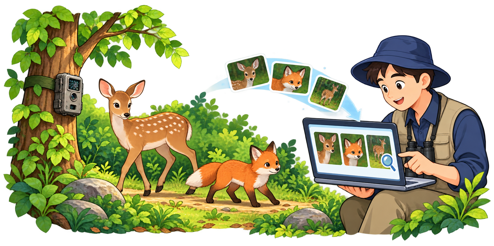

# 4단원 수정완료본 사용 이미지 목록

이 문서는 `pic` 원본과 일치한 60종을 먼저 정리한 대조 기록이다. 편집자에게 전달할 때는 이후 완성한 [전체 77종·배치 89곳의 완전본](../../docs/편집자전달_4단원_수정완료_20261001/이미지_배치목록.md)과 [전달 ZIP](../../docs/편집자전달_4단원_수정완료_20261001.zip)을 사용한다. 아래의 미확인 17종은 완전본에 한글 내부 원본으로 모두 확보되어 있다.

## 정리 결과

| 항목 | 확인 결과 |
|---|---|
| 기준 문서 | [초등5_인공지능리터러시_4단원_12쪽수정완료.hwpx](../../docs/편집자전달_4단원_수정완료_20261001/01_원고/초등5_인공지능리터러시_4단원_12쪽수정완료.hwpx) |
| 정리일 | 2026-10-01 |
| 문서에 사용된 이미지 | 77종, 총 89회 삽입 |
| 정리 전에 대조한 `pic` 이미지 | 116개 |
| `pic` 원본과 정확히 일치해 복사한 이미지 | 60종, 문서 내 72회 사용 |
| `pic`에서 동일 파일을 찾지 못한 이미지 | 17종 |
| 정리 방식 | 이 폴더에 복사. 기존 `pic` 파일은 이동·삭제·수정하지 않음 |
| 복사본 검증 | 60개 모두 원본 및 문서 내 이미지와 SHA256 일치, 이미지 디코딩 확인 |

본문의 실제 그림 참조를 따라 HWPX 내부 파일을 확인했다. ZIP에 들어 있다는 이유만으로 미사용 이미지를 목록에 포함하지 않았다. 대조는 SHA256, RGBA 픽셀, 흰 배경에 표시한 픽셀을 기준으로 수행했다. 이번에 복사한 60개는 모두 **바이트 단위로 동일한 파일**이다.

쪽수는 이번 **수정완료 HWPX의 펼침 지면 번호**이다. 기존 `pic` 파일명은 다른 편집본의 쪽수를 사용하므로, 파일명의 쪽수·왼쪽·오른쪽과 실제 사용 위치가 다를 수 있다. 원본을 추적할 수 있도록 파일명은 바꾸지 않았으며, 아래 표의 ‘수정완료본 사용 위치’를 기준으로 확인한다.

같은 이미지가 여러 지면에 사용된 경우에는 한 파일만 복사했다. `정리해요`의 마인드맵은 한글의 도형·글상자로 구성되어 있으므로 별도 이미지 파일로 분류하지 않았다.

## 복사한 이미지 60종

| 수정완료본 사용 위치 | HWPX 그림 ID | 삽화 내용 | 복사한 이미지 | pic 원본 | 크기(px) |
|---|---|---|---|---|---|
| 5쪽 오른쪽 페이지 | image6 | 내용확인학생 | [3쪽_왼_내용확인학생.png](./3쪽_왼_내용확인학생.png) | [원본](../3쪽_왼_내용확인학생.png) | 1536×1024 |
| 5쪽 오른쪽 페이지 | image7 | 사실확인아이콘 | [3쪽_왼_사실확인아이콘.png](./3쪽_왼_사실확인아이콘.png) | [원본](../3쪽_왼_사실확인아이콘.png) | 1536×1024 |
| 5쪽 오른쪽 페이지 | image8 | 피해확인학생 | [3쪽_왼_피해확인학생.png](./3쪽_왼_피해확인학생.png) | [원본](../3쪽_왼_피해확인학생.png) | 1536×1024 |
| 5쪽 오른쪽 페이지 | image9 | 개인정보보호아이콘 | [3쪽_왼_개인정보보호아이콘.png](./3쪽_왼_개인정보보호아이콘.png) | [원본](../3쪽_왼_개인정보보호아이콘.png) | 1536×1024 |
| 5쪽 오른쪽 페이지 | image10 | 인공지능활용학생 | [3쪽_왼_인공지능활용학생.png](./3쪽_왼_인공지능활용학생.png) | [원본](../3쪽_왼_인공지능활용학생.png) | 1536×1024 |
| 5쪽 오른쪽 페이지 | image11 | 출처표시아이콘 | [3쪽_왼_출처표시아이콘.png](./3쪽_왼_출처표시아이콘.png) | [원본](../3쪽_왼_출처표시아이콘.png) | 1536×1024 |
| 5쪽 오른쪽 페이지 | image12 | 인공지능활용표시아이콘 | [3쪽_왼_인공지능활용표시아이콘.png](./3쪽_왼_인공지능활용표시아이콘.png) | [원본](../3쪽_왼_인공지능활용표시아이콘.png) | 1254×1254 |
| 5쪽 왼쪽 페이지 5쪽 오른쪽 페이지 6쪽 왼쪽 페이지 (2회) 6쪽 오른쪽 페이지 (2회) 7쪽 왼쪽 페이지 7쪽 오른쪽 페이지 8쪽 왼쪽 페이지 8쪽 오른쪽 페이지 9쪽 왼쪽 페이지 | image13 | 활동연필아이콘 | [4쪽_양쪽_활동연필아이콘.png](./4쪽_양쪽_활동연필아이콘.png) | [원본](../4쪽_양쪽_활동연필아이콘.png) | 1536×1024 |
| 5쪽 왼쪽 페이지 | image14 | 도서관포스터확인장면 | [3쪽_오른_도서관포스터확인장면.png](./3쪽_오른_도서관포스터확인장면.png) | [원본](../3쪽_오른_도서관포스터확인장면.png) | 1672×941 |
| 6쪽 왼쪽 페이지 | image15 | 펼친책아이콘 | [4쪽_왼_펼친책아이콘.png](./4쪽_왼_펼친책아이콘.png) | [원본](../4쪽_왼_펼친책아이콘.png) | 1536×1024 |
| 6쪽 왼쪽 페이지 6쪽 오른쪽 페이지 | image16 | 새싹아이콘 | [4쪽_양쪽_새싹아이콘.png](./4쪽_양쪽_새싹아이콘.png) | [원본](../4쪽_양쪽_새싹아이콘.png) | 1374×1145 |
| 6쪽 오른쪽 페이지 | image17 | 태블릿공유장면 · 글자포함 | [4쪽_오른_태블릿공유장면_글자포함.png](./4쪽_오른_태블릿공유장면_글자포함.png) | [원본](../4쪽_오른_태블릿공유장면_글자포함.png) | 1672×941 |
| 6쪽 왼쪽 페이지 | image18 | 제작기록 · 만들기 | [4쪽_왼_제작기록_만들기.png](./4쪽_왼_제작기록_만들기.png) | [원본](../4쪽_왼_제작기록_만들기.png) | 1536×1024 |
| 6쪽 왼쪽 페이지 | image19 | 제작기록 · 확인하기 | [4쪽_왼_제작기록_확인하기.png](./4쪽_왼_제작기록_확인하기.png) | [원본](../4쪽_왼_제작기록_확인하기.png) | 1374×1145 |
| 6쪽 왼쪽 페이지 | image20 | 제작기록 · 고치기 | [4쪽_왼_제작기록_고치기.png](./4쪽_왼_제작기록_고치기.png) | [원본](../4쪽_왼_제작기록_고치기.png) | 1334×1179 |
| 6쪽 왼쪽 페이지 | image21 | 제작기록 · 밝히기 | [4쪽_왼_제작기록_밝히기.png](./4쪽_왼_제작기록_밝히기.png) | [원본](../4쪽_왼_제작기록_밝히기.png) | 1536×1024 |
| 7쪽 왼쪽 페이지 | image22 | 제목로봇마스코트 | [5쪽_왼_제목로봇마스코트.png](./5쪽_왼_제목로봇마스코트.png) | [원본](../5쪽_왼_제목로봇마스코트.png) | 1536×1024 |
| 7쪽 오른쪽 페이지 | image23 | 학습데이터아이콘 | [5쪽_오른_학습데이터아이콘.png](./5쪽_오른_학습데이터아이콘.png) | [원본](../5쪽_오른_학습데이터아이콘.png) | 1254×1254 |
| 7쪽 오른쪽 페이지 | image24 | 캐릭터질문학생 | [5쪽_오른_캐릭터질문학생.png](./5쪽_오른_캐릭터질문학생.png) | [원본](../5쪽_오른_캐릭터질문학생.png) | 1150×1368 |
| 7쪽 왼쪽 페이지 | image26 | 추천영상 · 멋진골모음 | [5쪽_왼_추천영상_멋진골모음.png](./5쪽_왼_추천영상_멋진골모음.png) | [원본](../5쪽_왼_추천영상_멋진골모음.png) | 1448×1086 |
| 7쪽 왼쪽 페이지 | image27 | 추천영상 · 축구하이라이트 | [5쪽_왼_추천영상_축구하이라이트.png](./5쪽_왼_추천영상_축구하이라이트.png) | [원본](../5쪽_왼_추천영상_축구하이라이트.png) | 1448×1086 |
| 7쪽 왼쪽 페이지 | image28 | 추천영상 · 축구기술배우기 | [5쪽_왼_추천영상_축구기술배우기.png](./5쪽_왼_추천영상_축구기술배우기.png) | [원본](../5쪽_왼_추천영상_축구기술배우기.png) | 1448×1086 |
| 7쪽 왼쪽 페이지 | image29 | 추천영상 · 댄스기초배우기 | [5쪽_왼_추천영상_댄스기초배우기.png](./5쪽_왼_추천영상_댄스기초배우기.png) | [원본](../5쪽_왼_추천영상_댄스기초배우기.png) | 1448×1086 |
| 7쪽 왼쪽 페이지 | image30 | 추천영상 · 간단한요리레시피 | [5쪽_왼_추천영상_간단한요리레시피.png](./5쪽_왼_추천영상_간단한요리레시피.png) | [원본](../5쪽_왼_추천영상_간단한요리레시피.png) | 1448×1086 |
| 7쪽 왼쪽 페이지 | image31 | 추천영상 · 재미있는과학실험 | [5쪽_왼_추천영상_재미있는과학실험.png](./5쪽_왼_추천영상_재미있는과학실험.png) | [원본](../5쪽_왼_추천영상_재미있는과학실험.png) | 1448×1086 |
| 7쪽 오른쪽 페이지 | image32 | 학습사진1 · 청진기의사 | [5쪽_오른_학습사진1_청진기의사.png](./5쪽_오른_학습사진1_청진기의사.png) | [원본](../5쪽_오른_학습사진1_청진기의사.png) | 1122×1402 |
| 7쪽 오른쪽 페이지 | image33 | 학습사진2 · 차트보는의사 | [5쪽_오른_학습사진2_차트보는의사.png](./5쪽_오른_학습사진2_차트보는의사.png) | [원본](../5쪽_오른_학습사진2_차트보는의사.png) | 1122×1402 |
| 7쪽 오른쪽 페이지 | image34 | 학습사진3 · 주사기의사 | [5쪽_오른_학습사진3_주사기의사.png](./5쪽_오른_학습사진3_주사기의사.png) | [원본](../5쪽_오른_학습사진3_주사기의사.png) | 1122×1402 |
| 7쪽 오른쪽 페이지 | image35 | 학습사진4 · 환자와의사 | [5쪽_오른_학습사진4_환자와의사.png](./5쪽_오른_학습사진4_환자와의사.png) | [원본](../5쪽_오른_학습사진4_환자와의사.png) | 1122×1402 |
| 7쪽 오른쪽 페이지 | image36 | 학습사진5 · 팔짱낀의사 | [5쪽_오른_학습사진5_팔짱낀의사.png](./5쪽_오른_학습사진5_팔짱낀의사.png) | [원본](../5쪽_오른_학습사진5_팔짱낀의사.png) | 1122×1402 |
| 7쪽 오른쪽 페이지 | image37 | 판단대상 · 여자의사 | [5쪽_오른_판단대상_여자의사.png](./5쪽_오른_판단대상_여자의사.png) | [원본](../5쪽_오른_판단대상_여자의사.png) | 1448×1086 |
| 7쪽 오른쪽 페이지 | image38 | 판단대상 · 과학선생님 | [5쪽_오른_판단대상_과학선생님.png](./5쪽_오른_판단대상_과학선생님.png) | [원본](../5쪽_오른_판단대상_과학선생님.png) | 1448×1086 |
| 8쪽 왼쪽 페이지 | image39 | 딥페이크얼굴아이콘 | [6쪽_왼_딥페이크얼굴아이콘.png](./6쪽_왼_딥페이크얼굴아이콘.png) | [원본](../6쪽_왼_딥페이크얼굴아이콘.png) | 1254×1254 |
| 8쪽 오른쪽 페이지 | image40 | AI대화아이콘 | [6쪽_오른_AI대화아이콘.png](./6쪽_오른_AI대화아이콘.png) | [원본](../6쪽_오른_AI대화아이콘.png) | 1536×1024 |
| 8쪽 오른쪽 페이지 | image41 | 정서적의존학생 | [6쪽_오른_정서적의존학생.png](./6쪽_오른_정서적의존학생.png) | [원본](../6쪽_오른_정서적의존학생.png) | 1024×1536 |
| 9쪽 왼쪽 페이지 9쪽 오른쪽 페이지 | image44 | 새싹아이콘 | [7쪽_양쪽_새싹아이콘.png](./7쪽_양쪽_새싹아이콘.png) | [원본](../7쪽_양쪽_새싹아이콘.png) | 1254×1254 |
| 9쪽 왼쪽 페이지 | image45 | 인삼밭AI관리장면 | [7쪽_왼_인삼밭AI관리장면.png](./7쪽_왼_인삼밭AI관리장면.png) | [원본](../7쪽_왼_인삼밭AI관리장면.png) | 1254×1254 |
| 9쪽 오른쪽 페이지 | image46 | 추천영상아이콘 | [7쪽_오른_추천영상아이콘.png](./7쪽_오른_추천영상아이콘.png) | [원본](../7쪽_오른_추천영상아이콘.png) | 1254×1254 |
| 9쪽 오른쪽 페이지 | image47 | 치우친자료아이콘 | [7쪽_오른_치우친자료아이콘.png](./7쪽_오른_치우친자료아이콘.png) | [원본](../7쪽_오른_치우친자료아이콘.png) | 1254×1254 |
| 9쪽 오른쪽 페이지 | image48 | 일자리변화아이콘 | [7쪽_오른_일자리변화아이콘.png](./7쪽_오른_일자리변화아이콘.png) | [원본](../7쪽_오른_일자리변화아이콘.png) | 1254×1254 |
| 9쪽 오른쪽 페이지 | image49 | 가짜정보아이콘 | [7쪽_오른_가짜정보아이콘.png](./7쪽_오른_가짜정보아이콘.png) | [원본](../7쪽_오른_가짜정보아이콘.png) | 1254×1254 |
| 9쪽 오른쪽 페이지 | image50 | 과의존아이콘 | [7쪽_오른_과의존아이콘.png](./7쪽_오른_과의존아이콘.png) | [원본](../7쪽_오른_과의존아이콘.png) | 1254×1254 |
| 9쪽 오른쪽 페이지 | image51 | 도움말전구아이콘 | [7쪽_오른_도움말전구아이콘.png](./7쪽_오른_도움말전구아이콘.png) | [원본](../7쪽_오른_도움말전구아이콘.png) | 1254×1254 |
| 10쪽 왼쪽 페이지 | image52 | 지구새싹아이콘 | [8쪽_양쪽_지구새싹아이콘.png](./8쪽_양쪽_지구새싹아이콘.png) | [원본](../8쪽_양쪽_지구새싹아이콘.png) | 1254×1254 |
| 10쪽 왼쪽 페이지 | image57 | 데이터센터책아이콘 | [8쪽_왼_데이터센터책아이콘.png](./8쪽_왼_데이터센터책아이콘.png) | [원본](../8쪽_왼_데이터센터책아이콘.png) | 1254×1254 |
| 11쪽 왼쪽 페이지 | image63 | 데이터센터자원메인장면 | [9쪽_왼_데이터센터자원메인장면.png](./9쪽_왼_데이터센터자원메인장면.png) | [원본](../9쪽_왼_데이터센터자원메인장면.png) | 1981×793 |
| 11쪽 왼쪽 페이지 | image64 | 데이터센터내부 | [9쪽_왼_데이터센터내부.png](./9쪽_왼_데이터센터내부.png) | [원본](../9쪽_왼_데이터센터내부.png) | 1536×1024 |
| 11쪽 왼쪽 페이지 | image65 | 전기와물냉각장치 | [9쪽_왼_전기와물냉각장치.png](./9쪽_왼_전기와물냉각장치.png) | [원본](../9쪽_왼_전기와물냉각장치.png) | 1536×1024 |
| 11쪽 왼쪽 페이지 | image66 | 탄소발자국장면 | [9쪽_왼_탄소발자국장면.png](./9쪽_왼_탄소발자국장면.png) | [원본](../9쪽_왼_탄소발자국장면.png) | 1536×1024 |
| 11쪽 오른쪽 페이지 | image67 | 글요청아이콘 | [9쪽_오른_글요청아이콘.png](./9쪽_오른_글요청아이콘.png) | [원본](../9쪽_오른_글요청아이콘.png) | 1536×1024 |
| 11쪽 오른쪽 페이지 | image68 | 그림요청아이콘 | [9쪽_오른_그림요청아이콘.png](./9쪽_오른_그림요청아이콘.png) | [원본](../9쪽_오른_그림요청아이콘.png) | 1536×1024 |
| 11쪽 오른쪽 페이지 | image69 | 생각정리아이콘 | [9쪽_오른_생각정리아이콘.png](./9쪽_오른_생각정리아이콘.png) | [원본](../9쪽_오른_생각정리아이콘.png) | 1536×1024 |
| 11쪽 오른쪽 페이지 | image70 | 글계획아이콘 | [9쪽_오른_글계획아이콘.png](./9쪽_오른_글계획아이콘.png) | [원본](../9쪽_오른_글계획아이콘.png) | 1312×1199 |
| 11쪽 오른쪽 페이지 | image71 | 그림계획아이콘 | [9쪽_오른_그림계획아이콘.png](./9쪽_오른_그림계획아이콘.png) | [원본](../9쪽_오른_그림계획아이콘.png) | 1536×1024 |
| 11쪽 오른쪽 페이지 | image72 | 글다시만들기아이콘 | [9쪽_오른_글다시만들기아이콘.png](./9쪽_오른_글다시만들기아이콘.png) | [원본](../9쪽_오른_글다시만들기아이콘.png) | 1312×1199 |
| 11쪽 오른쪽 페이지 | image73 | 그림다시만들기아이콘 | [9쪽_오른_그림다시만들기아이콘.png](./9쪽_오른_그림다시만들기아이콘.png) | [원본](../9쪽_오른_그림다시만들기아이콘.png) | 1402×1122 |
| 11쪽 오른쪽 페이지 | image74 | 새아이디어아이콘 | [9쪽_오른_새아이디어아이콘.png](./9쪽_오른_새아이디어아이콘.png) | [원본](../9쪽_오른_새아이디어아이콘.png) | 1374×1145 |
| 11쪽 오른쪽 페이지 | image75 | 글부분수정아이콘 | [9쪽_오른_글부분수정아이콘.png](./9쪽_오른_글부분수정아이콘.png) | [원본](../9쪽_오른_글부분수정아이콘.png) | 1366×1151 |
| 11쪽 오른쪽 페이지 | image76 | 그림부분수정아이콘 | [9쪽_오른_그림부분수정아이콘.png](./9쪽_오른_그림부분수정아이콘.png) | [원본](../9쪽_오른_그림부분수정아이콘.png) | 1536×1024 |
| 12쪽 오른쪽 페이지 | image77 | 숲속동물과인공지능 | [12쪽_오른_숲속동물과인공지능.png](./12쪽_오른_숲속동물과인공지능.png) | [원본](../12쪽_오른_숲속동물과인공지능.png) | 1774×887 |

## 미확인 이미지 17종

아래 이미지는 HWPX 문서 내부에는 존재하지만, 이번에 대조한 `pic`에서 동일한 파일이나 동일 픽셀의 이미지를 찾지 못했다. 따라서 이 폴더에는 복사하지 않았다. 유사한 그림을 실제 사용 원본으로 임의 지정하지 않았으며, 파일의 변형 여부나 별도 보관 위치는 확정하지 않았다.

| 수정완료본 사용 위치 | HWPX 그림 ID | 문서 내부 파일 | 크기(px) | 상태 |
|---|---|---|---|---|
| 3쪽 왼쪽 페이지 | image1 | `BinData/image1.png` | 1448×1086 | pic 동일 파일·픽셀 미확인 |
| 3쪽 왼쪽 페이지 | image2 | `BinData/image2.png` | 1122×1402 | pic 동일 파일·픽셀 미확인 |
| 3쪽 오른쪽 페이지 | image3 | `BinData/image3.png` | 1448×1086 | pic 동일 파일·픽셀 미확인 |
| 4쪽 왼쪽 페이지 | image4 | `BinData/image4.png` | 1448×1086 | pic 동일 파일·픽셀 미확인 |
| 4쪽 오른쪽 페이지 | image5 | `BinData/image5.png` | 1254×1254 | pic 동일 파일·픽셀 미확인 |
| 7쪽 왼쪽 페이지 | image25 | `BinData/image25.bmp` | 121×189 | pic 동일 파일·픽셀 미확인 |
| 8쪽 왼쪽 페이지 | image42 | `BinData/image42.PNG` | 1672×941 | pic 동일 파일·픽셀 미확인 |
| 8쪽 오른쪽 페이지 | image43 | `BinData/image43.PNG` | 1672×941 | pic 동일 파일·픽셀 미확인 |
| 10쪽 오른쪽 페이지 | image53 | `BinData/image53.PNG` | 1448×1086 | pic 동일 파일·픽셀 미확인 |
| 10쪽 오른쪽 페이지 | image54 | `BinData/image54.PNG` | 1448×1086 | pic 동일 파일·픽셀 미확인 |
| 10쪽 오른쪽 페이지 | image55 | `BinData/image55.PNG` | 1254×1254 | pic 동일 파일·픽셀 미확인 |
| 10쪽 오른쪽 페이지 | image56 | `BinData/image56.PNG` | 1254×1254 | pic 동일 파일·픽셀 미확인 |
| 10쪽 왼쪽 페이지 | image58 | `BinData/image58.PNG` | 1086×1448 | pic 동일 파일·픽셀 미확인 |
| 10쪽 왼쪽 페이지 | image59 | `BinData/image59.PNG` | 1254×1254 | pic 동일 파일·픽셀 미확인 |
| 10쪽 왼쪽 페이지 | image60 | `BinData/image60.PNG` | 1448×1086 | pic 동일 파일·픽셀 미확인 |
| 10쪽 왼쪽 페이지 | image61 | `BinData/image61.PNG` | 1086×1448 | pic 동일 파일·픽셀 미확인 |
| 10쪽 왼쪽 페이지 | image62 | `BinData/image62.PNG` | 1086×1448 | pic 동일 파일·픽셀 미확인 |

이 폴더는 `pic`에서 찾아 확인한 60종의 묶음이며, 문서의 이미지 77종 전체를 추출한 묶음은 아니다.

## 확인 기록

- 기준 HWPX SHA256: `428f0a1d5280d9d9ca1a1966b0a651703bdf0baef76852c8ab4b18668707d0aa`
- 복사본의 형식·크기·픽셀은 원본 그대로이며, 재인코딩·배경 제거·리사이즈하지 않았다.
- 기준 HWPX와 PDF는 변경하지 않았다.
- [전체 삽화 목록](../삽화_리스트.md)에는 이 정리 폴더의 안내 링크를 추가했다.

## 12쪽 새 삽화 미리보기

